  

  

# Hi, I'm Adil 👋

I build practical **AI products** around **RAG, AI agents, voice AI, product analytics, and automation**.

Most of my work is hands-on: I start with a real user problem, shape the workflow, build a working prototype, test edge cases, and think about how the product should be measured after launch.

**What I work on**

- AI Agents: workflow automation, tool use, voice agents, multi-step tasks
- RAG Products: retrieval, grounding, contextual Q&A, evidence-backed answers
- AI Product Evaluation: hallucination, trust, latency, grounding, failure handling
- Product Analytics: metrics, funnels, campaign performance, feedback loops
- Prototyping: Python, Streamlit, LangChain, FAISS, Ollama

## 🚀 Selected Projects

### 📊 [AI Campaign Analyst RAG](https://github.com/sayedadil122/AI-Campaign-Analyst-RAG)
Upload campaign data → calculate KPIs → retrieve relevant context → ask questions → get evidence-backed recommendations.

### 🧠 [Employee Handover Copilot](https://github.com/sayedadil122/employee-handover-copilot)
A RAG-based knowledge-transfer assistant designed to reduce information loss during employee handovers.

### 📞 [JobRadar Voice](https://github.com/sayedadil122/jobradar-voice)
A voice AI agent that calls nearby businesses to discover unposted jobs and converts conversations into structured hiring data.

### 🩺 [Aftercare AI](https://github.com/sayedadil122/aftercare-ai)
An AI product focused on improving post-care workflows, follow-up experiences, and continuity after treatment.

### 🔎 [SignalPilot](https://github.com/sayedadil122/SignalPilot)
Turns scattered customer feedback into themes, product opportunities, competitor gaps, and actionable insights.

### 🎯 [Eventra](https://github.com/sayedadil122/Eventra)
An AI event-planning assistant for planning, vendor discovery, timelines, reminders, dependencies, and budget tracking.

### 🛍️ [BuyWise AI](https://github.com/sayedadil122/BuyWise-AI)
An AI shopping assistant for researching, comparing, and making better purchase decisions.

<b>More Builds</b>

 

- 🔍 [SourceLens](https://github.com/sayedadil122/SourceLens) — experiment around working with information and sources more effectively.
- 💇 [Salon App](https://github.com/sayedadil122/Salon-App) — customer, staff, service, billing, CRM, and salon operations.
- 🍽️ [SnapCalories](https://github.com/sayedadil122/SnapCalories) — food and calorie tracking product experiment.

## 🧠 How I Think About AI Products

- Start with the **user problem**, not the model.
- AI quality is a product problem: measure **grounding, hallucination, latency, trust, and task success**.
- Prototype quickly, but validate whether AI actually improves the workflow.
- Design for failure cases, not only happy paths.
- Build feedback loops so the product improves after launch.

## 🧰 Stack & Product Skills

`AI Product Management` · `RAG` · `LLMs` · `AI Agents` · `Voice AI` · `Prompt Engineering` · `Product Analytics` · `Python` · `Streamlit` · `FAISS` · `LangChain` · `Ollama`

## 🤝 Let's Connect

I'm especially interested in **AI Product Manager / APM opportunities**, AI-native products, RAG systems, and agentic workflows.

[LinkedIn](https://www.linkedin.com/in/adilabbaspm/) · [GitHub](https://github.com/sayedadil122)

---

<b>Building AI products that solve real problems.</b>

